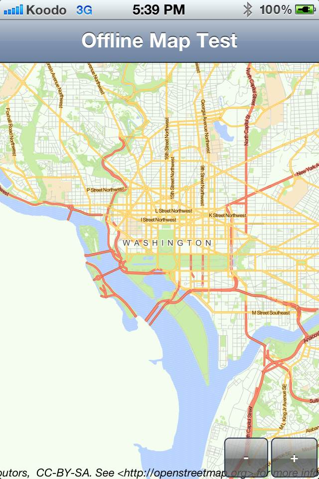

# Codename Offline Maps Provider

This library includes a MapProvider that works with the Codename One MapComponent class to provide support for offline maps. 

## License

LGPL

## Features

* Should work on all CN1 platforms (J2ME, iOS, Android, BlackBerry, and Windows Phone).
* Works with the Codename One MapComponent
* Supports the `CN1Tiles` format for importing map data.  Note:  This format was created specifically for use by this module, however, you can use the CN1TileConverter tool to convert the more common `MBTiles` format into a `CN1Tiles` file that can be used with this module.

## Dependencies

1. [CN1JTar Library](https://github.com/shannah/CN1JTar)

## Installation

1. Install the [CN1JTar](https://github.com/shannah/CN1JTar) library into your project.
2. Copy the [CN1OfflineMaps.cn1lib](https://github.com/shannah/CN1OfflineMaps/raw/master/dist/CN1OfflineMaps.cn1lib) file into the lib directory of your codename one project.
3. Right click on your project in the project explorer (if using Netbeans) and click "Refresh Libs".

## Code Example

~~~
MBTilesProvider provider; 
if ( MBTilesProvider.isLoaded("output.cn1tiles") ){
    // The map named "output.cn1tiles" is already loaded…
    // We can just create a provider for this map.
    provider = new MBTilesProvider("output.cn1tiles");
} else {
    // The map specified hasn't been created yet…
    // We can create this in a number of ways including:
    // From resources (i.e. include the output.cn1tiles file as part of 
    // the application bundle):
    if ( CREATE_FROM_RESOURCE ){
        provider = MBTilesProvider.createFromResource("/output.cn1tiles");
    } else if ( CREATE_FROM_FILE ){
        // Or from the file system
        provider = MBTilesProvider.createFromFile("/path/to/output.cn1tiles");
    } else if ( CREATE FROM INPUTSTREAM ){
        InputStream is = getInputStream();  // Could be from a server
        provider = MBTilesProvider.create("output.cn1tiles", is);
    }
        
}

// With our loaded MBTilesProvider let's create a MapComponent and add it to a form:
MapComponent map = new MapComponent(provider, provider.center(), provider.minZoomLevel(), false);
Form hi = new Form("Offline Map Test");
hi.setScrollable(false);
hi.setLayout(new BorderLayout());
hi.addComponent(BorderLayout.CENTER, map);
hi.show();
~~~

## How to Create an Offline Map

This libray is only useful if you are able to create the `cn1tiles` file to begin with.  In order to do this you will need the following tools:

1. [TileMill](https://www.mapbox.com/tilemill/) - A Desktop application that allows you to create maps using public data sources like Open Street Maps.
2. [CN1TileConverter](https://github.com/shannah/CN1TileConverter) - A Desktop utility that converts `mbtiles` files to `cn1tiles` format.  This was designed specifically to be used with this library.

**Step 1:** Create your map in TileMill.

**Step 2:** [Export your map](https://www.mapbox.com/tilemill/docs/manual/exporting/) as an `mbtiles` file.

**Step 3:** Convert your .mbtiles file to a .cn1tiles file using CN1TileConverter

**Step 4:** Load the .cn1tiles file inside your Codename One application usin the MBTilesProvider class.  You can either embed the file as part of your application source, or place it on a server and have your application download it on first load (or some other logical time).
